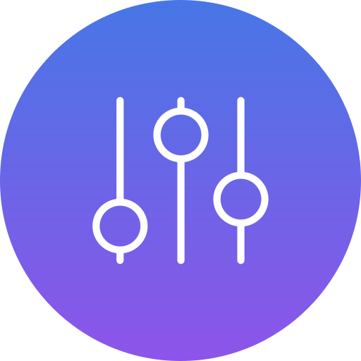

## Deej Companion

<br/>


This is a companion application for Deej, a StreamDeck like DIY mixer. 
It connects to Deej via a serial port and to a MIDI device (a virtual MIDI device is required - like [loopMIDI](https://www.tobias-erichsen.de/software/loopmidi.html)). 
It will forward MIDI messages to a DAW or any other application (e.g. [Voicemmeter](https://vb-audio.com/Voicemeeter/potato.htm) or [MIDI Mixer](https://www.midi-mixer.com/)).

Based on [SerialMidiBridge](https://github.com/chava100f/SerialMidiBridge) python script.


### Usage

After starting you will be able to choose the serial port, baudrate, MIDI In and MIDI Out port. The Scan button will re-scan for available serial and midi ports. Your selection is remembered for next usage. 

#### MIDI Mixer

A preset for [MIDI Mixer](https://www.midi-mixer.com/) app containing pre-made mappings is available. You can load it by clicking this link:  
[midi-mixer://share/28038c8922a2f53ac3d042145ebbd1c3](midi-mixer://share/28038c8922a2f53ac3d042145ebbd1c3)

### Firmware

If you're looking for Deej firmware, you can find it [here](https://github.com/UnoMartino/Deej-Firmware).


### Adapting/building

If you want to make changes or build your own application you can use the provided build script. Required packages are listed in the requirements.txt file. You can install them with pip as follows:

```
pip install -r requirements.txt
```

To build the application you can use the provided build script. It will create a standalone executable in the dist folder.

```
build.bat
```

Pyinstaller can be installed as follows:

```
pip install pyinstaller
```

#### Creating a Windows installer

You can create a Windows installer with the provided NSIS script `installer.nsi`. You will need to install NSIS. You can then use the "Compile NSIS Script" option in the NSIS app. 

### Notes

You are free to modify the project according to the license.
